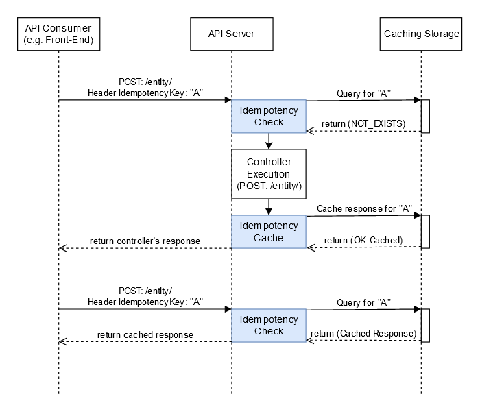

# Idempotent API <sup>BETA</sup>

An idempotent HTTP method is a HTTP method that can be called many times without different outcomes. Safe methods are HTTP methods that do not modify resources. Idempotent API is an ASP.NET Core attribute by which any HTTP write operations (POST and PATCH) can have effect only once for the given request data.

| HTTP Method | Idempotent? | Safe? | Description                                                  |
| ----------- | ----------- | ----- | ------------------------------------------------------------ |
| GET         | Yes         | Yes   | The safe HTTP methods do not modify resources. Thus, multiple calls to the resource will always return the same response. |
| OPTIONS     | Yes         | Yes   | --//--                                                       |
| HEAD        | Yes         | Yes   | --//--                                                       |
| PUT         | Yes         | No    | The PUT method is idempotent, as calling the PUT method multiple times will update the same resource and not change the outcome. |
| DELETE      | Yes         | No    | The DELETE is idempotent because once the resource is deleted, it is gone and calling the method multiple times will not change the outcome |
| POST        | **No**      | No    | Calling the POST method multiple times can have different results and will result in creating new resources. For that reason, the POST method is **not** idempotent. |
| PATCH       | **No**      | No    | The PATCH method can be idempotent, but it isn't required to be. For that reason, it is characterized as **non**-idempotent. |

## How it works

The API client (e.g. a Front-End website) sends a request including an Idempotency-Key header (default: IdempotencyKey) with a unique-identifier value. The API server checks if that unique-identifier has been used previously for that request and either return the cached response (without further execution) or save-cache the response along with the unique-identifier. The cached response includes the HTTP status code and the response body and headers. 

The IdempotentAPI library performs additional validation of the request's hash-key in order to be sure that the cached response is returned for the same combination of IdempotencyKey and Request to prevent accidental misuse.

The following image shows an example of the IdempotentAPI library flow for two same POST requests. As shown in this image, IdempotentAPI library includes two additional steps, one prior to the controller's execution and one after the construction of the controller's response.



### Persistent Storage and Cache Expiration

The unique-identifiers and their responding result are stored in a persistent storage (e.g. database, file, Redis, etc.). Although this mechanism of saving the data can be very useful, if the data is not expired after a certain period of time, it includes unneeded complexity from the perspective of data storage, security and scaling. The data should have a retention period that makes sense for your problem domain.

### Idempotent Clients

- An idempotency key is a unique value generated by the client which the server uses to recognize subsequent retries of the same request.
- It is suggested to use "[V4 UUIDs](https://en.wikipedia.org/wiki/Universally_unique_identifier)" for the creation of the idempotency unique keys.
- It is recommended to use techniques like [exponential backoff and random jitter](https://aws.amazon.com/blogs/architecture/exponential-backoff-and-jitter/).

## NuGet package

IdempotentAPI library is available as a NuGet package. The NuGet package can be accessed [here](https://www.nuget.org/packages/IdempotentAPI/).

## Configuration

### Register the Distributed Cache (as Persistent Storage)

Register an implementation of IDistributedCache in Startup.ConfigureServices (such as Memory Cache, SQL Server cache, Redis cache, etc.). For more details see the "[Distributed caching in ASP.NET Core](https://docs.microsoft.com/en-us/aspnet/core/performance/caching/distributed)" article.

```c#
// For example, to use memory cache
services.AddDistributedMemoryCache();
```

### Mark DTOs as Serializable

Mark all the response DTOs models as Serializable in order to be cached. For example, see the code below.

```c#
using System;

namespace WeatherForecastAPI.Core.Application.Services.DTOs
{
    [Serializable]
    public class WeatherForecastModel
    {
        public DateTime Date { get; set; }
        public int TemperatureC { get; set; }
        public string Summary { get; set; }
    }
}

```

#### Configure the API Controllers

In your `Controller` class, add the following using statement and then, choose the Idempotent operations by setting the `Idempotent()` attribute, either on the controller's Class or on each action.

```c#
using IdempotentAPI.Filters;
```

##### Using the Idempotent attribute on a Controller's Class

By using the  Idempotent attribute on the API Controller's Class, `ALL` the POST and PATCH actions will be Idempotent operations (requiring the IdempotencyKey header).

```c#
[ApiController]
[Route("[controller]")]
[Idempotent()]
public class WeatherForecastController : ControllerBase
{
	// ...
}
```

##### Using the Idempotent attribute on a Controller's Action

By using the Idempotent attribute on the actions that support the HTTP POST or PATCH methods, you can select which specific actions will be Idempotent and also set different options.

```c#
[HttpPost]
[Idempotent(ExpireHours = 48)]
public Task<IActionResult> Create([FromBody] WeatherForecast weatherForecastDto)
{
	// ...
}
```

#### Idempotent Attribute Options

| Name                       | Type   | Default Value  | Description                                                  |
| -------------------------- | ------ | -------------- | ------------------------------------------------------------ |
| Enabled                    | bool   | true           | Enable or Disable the Idempotent operation on an API Controller's class or method. |
| ExpireHours                | int    | 24             | The retention period of the cached idempotent data.          |
| HeaderKeyName              | string | IdempotencyKey | The name of the Idempotency-Key header.                      |
| DistributedCacheKeysPrefix | string | IdempAPI_      | A prefix for the key names that will be used in the DistributedCache. |


## License
The IdempotentAPI is [MIT licensed](./LICENSE.md).